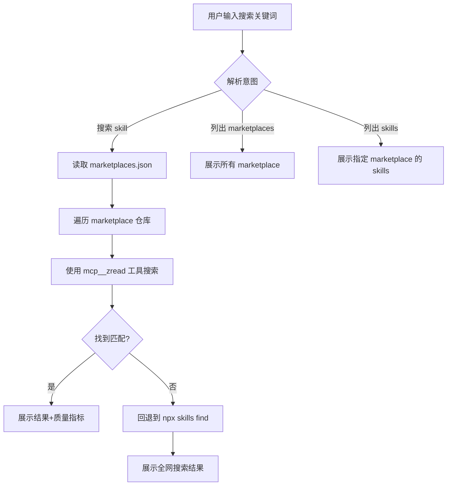

# 增强版 find-skills 设计文档

**日期**: 2026-03-09
**作者**: Claude Code
**状态**: 设计阶段

---

## 1. 项目概述

### 1.1 背景

现有的 `find-skills` skill 提供了基础的 skill 搜索功能，但存在以下问题：

1. **搜索范围不可控**：全网搜索可能返回质量参差不齐的结果
2. **缺乏质量评估**：无法判断 skill 的受欢迎程度和维护状态
3. **无法查看 marketplace 全貌**：不知道每个 marketplace 包含哪些 skills

### 1.2 目标

创建一个增强版的 find-skills skill，核心功能：

1. **维护可信赖的 marketplace 清单**：内置 JSON 配置文件
2. **优先从清单搜索**：确保搜索结果质量
3. **列出 marketplace 内容**：展示每个仓库包含的所有 skills
4. **评估 skill 质量**：基于 Stars、更新时间等指标
5. **对比不同来源**：当多个 marketplace 有类似 skill 时提供对比

### 1.3 成功标准

- ✅ 用户搜索 skill 时，优先从预定义的 marketplace 搜索
- ✅ 可以列出所有可信赖 marketplace 及其包含的 skills
- ✅ 搜索结果包含质量指标（Stars、更新时间）
- ✅ 保持向后兼容，不破坏现有 find-skills 功能

---

## 2. 核心功能

### 2.1 功能清单

| 功能 | 描述 | 优先级 |
|------|------|--------|
| **优先搜索** | 从 marketplaces.json 中的仓库优先搜索 | P0 |
| **列出 marketplaces** | 展示所有可信赖 marketplace | P0 |
| **列出 skills** | 展示指定 marketplace 的所有 skills | P0 |
| **质量评估** | 显示 Stars、更新时间等指标 | P1 |
| **全网搜索回退** | 清单中找不到时回退到全网搜索 | P1 |
| **对比功能** | 对比不同 marketplace 的类似 skills | P2 |

### 2.2 触发条件

**自动触发**：
- 用户说："帮我搜索/查找 [功能] 相关的 skill"
- 用户说："有没有 [功能] 的 skill"
- 用户说："我想找 [功能] 的 skill"

**显式命令**：
- `/find-skills search [关键词]` - 搜索 skill
- `/find-skills list-marketplaces` - 列出所有 marketplace
- `/find-skills list-skills [marketplace]` - 列出指定 marketplace 的 skills

---

## 3. 配置文件结构

### 3.1 marketplaces.json

**位置**: `~/.claude/skills/find-skills/marketplaces.json`

**结构**:

```json
{
  "version": "1.0.0",
  "lastUpdated": "2026-03-09T00:00:00Z",
  "marketplaces": [
    {
      "id": "anthropics-skills",
      "name": "Anthropic Official Skills",
      "repository": "anthropics/skills",
      "description": "Anthropic 官方维护的 skill 仓库",
      "category": "official",
      "trustLevel": "high",
      "metadata": {
        "stars": 66600,
        "lastUpdated": "2026-03-01",
        "maintainer": "anthropics"
      },
      "skills": [
        {
          "name": "mcp-builder",
          "path": "mcp-builder",
          "description": "构建 MCP 服务器"
        },
        {
          "name": "skill-creator",
          "path": "skill-creator",
          "description": "创建新 skill"
        }
      ]
    },
    {
      "id": "everything-claude-code",
      "name": "Everything Claude Code",
      "repository": "affaan-m/everything-claude-code",
      "description": "最大的 Claude Code 资源集合",
      "category": "community",
      "trustLevel": "medium",
      "metadata": {
        "stars": 40800,
        "lastUpdated": "2026-03-05",
        "maintainer": "affaan-m"
      },
      "skills": []
    }
  ]
}
```

### 3.2 字段说明

| 字段 | 类型 | 必填 | 说明 |
|------|------|------|------|
| `id` | string | ✅ | 唯一标识符 |
| `name` | string | ✅ | 显示名称 |
| `repository` | string | ✅ | GitHub 仓库（owner/repo） |
| `description` | string | ✅ | 简要描述 |
| `category` | enum | ✅ | 分类：official/community/personal |
| `trustLevel` | enum | ✅ | 信任等级：high/medium/low |
| `metadata.stars` | number | ❌ | GitHub Stars 数 |
| `metadata.lastUpdated` | string | ❌ | 最后更新时间 |
| `skills` | array | ❌ | 包含的 skills 列表（可动态获取） |

---

## 4. 实现细节

### 4.1 搜索流程



### 4.2 工具使用

**优先使用 MCP 工具**：

| 工具 | 用途 |
|------|------|
| `mcp__zread__get_repo_structure` | 获取仓库结构 |
| `mcp__zread__read_file` | 读取 SKILL.md |
| `mcp__zread__search_doc` | 搜索文档和 issues |
| `mcp__web-search-prime__web_search_prime` | 搜索 GitHub 项目 |

**回退方案**：
- 使用 `npx skills find [query]` 进行全网搜索
- 使用 WebSearch 搜索 GitHub

### 4.3 质量评估算法

```javascript
function calculateQualityScore(skill) {
  const weights = {
    stars: 0.4,          // Stars 权重
    recency: 0.3,        // 更新时间权重
    trustLevel: 0.3      // 信任等级权重
  };

  const starsScore = normalizeStars(skill.metadata.stars);
  const recencyScore = calculateRecency(skill.metadata.lastUpdated);
  const trustScore = getTrustScore(skill.trustLevel);

  return (
    starsScore * weights.stars +
    recencyScore * weights.recency +
    trustScore * weights.trustLevel
  );
}
```

**信任等级分数**：
- `high`: 100 分
- `medium`: 70 分
- `low`: 40 分

---

## 5. 文件清单

### 5.1 需要创建的文件

```
~/.claude/skills/find-skills/
├── SKILL.md                    # 更新后的 skill 定义
├── marketplaces.json           # marketplace 清单配置
└── scripts/                    # 可选：辅助脚本
    └── update-marketplaces.sh  # 更新 marketplace 元数据
```

### 5.2 需要修改的文件

| 文件 | 修改内容 |
|------|----------|
| `SKILL.md` | 添加 marketplace 优先搜索逻辑 |
| `marketplaces.json` | 新建，存储配置 |

---

## 6. 用户体验设计

### 6.1 搜索结果展示

```
找到 3 个匹配的 skills（按质量排序）：

1. mcp-builder (anthropics/skills)
   ⭐ 66.6k stars | 🕐 最近更新: 2026-03-01 | 🏆 官方
   📝 构建 MCP 服务器的官方工具

   安装: npx skills add anthropics/skills@mcp-builder

2. mcp-server-builder (ComposioHQ/awesome-claude-skills)
   ⭐ 19.9k stars | 🕐 最近更新: 2026-02-28 | ✅ 社区
   📝 社区维护的 MCP 构建工具

   安装: npx skills add ComposioHQ/awesome-claude-skills@mcp-server-builder

---
💡 提示：结果来自可信赖 marketplace 清单
   使用 /find-skills list-marketplaces 查看所有来源
```

### 6.2 列出 marketplaces

```
可信赖的 Marketplace 清单（共 5 个）：

┌─────────────────────────────┬────────┬────────┬──────────┐
│ 名称                        │ Stars  │ 等级   │ Skills   │
├─────────────────────────────┼────────┼────────┼──────────┤
│ Anthropic Official Skills   │ 66.6k  │ 🏆 官方 │ 12       │
│ Everything Claude Code      │ 40.8k  │ ✅ 社区 │ 100+     │
│ Awesome Claude Skills       │ 19.9k  │ ✅ 社区 │ 50+      │
│ Jacky's Skills              │ 1.2k   │ 👤 个人 │ 15       │
└─────────────────────────────┴────────┴────────┴──────────┘

使用 /find-skills list-skills [marketplace] 查看详细内容
```

---

## 7. 错误处理

| 场景 | 处理方式 |
|------|----------|
| marketplaces.json 不存在 | 自动创建默认配置 |
| GitHub API 限流 | 使用缓存数据，提示用户稍后重试 |
| 仓库不存在 | 标记为无效，从清单中移除建议 |
| 网络错误 | 回退到本地缓存或提示检查网络 |

---

## 8. 测试策略

### 8.1 测试场景

| 场景 | 预期结果 |
|------|----------|
| 搜索存在的 skill | 展示匹配结果 + 质量指标 |
| 搜索不存在的 skill | 回退到全网搜索 |
| 列出 marketplaces | 展示所有配置的 marketplace |
| 列出 skills | 展示指定 marketplace 的所有 skills |
| 配置文件损坏 | 自动恢复默认配置 |

### 8.2 验收标准

- ✅ 搜索功能正常工作
- ✅ 质量指标准确显示
- ✅ 列表功能完整
- ✅ 错误处理优雅
- ✅ 向后兼容

---

## 9. 后续优化

### 9.1 Phase 2 功能

- 自动更新 marketplace 元数据（定时任务）
- 用户自定义 marketplace（配置文件扩展）
- Skill 评分和评论系统
- 推荐算法（基于用户历史）

### 9.2 性能优化

- 缓存 marketplace 数据
- 并行搜索多个仓库
- 增量更新配置

---

## 10. 参考资源

- [skills.sh 官方文档](https://skills.sh)
- [Anthropic Skills 仓库](https://github.com/anthropics/skills)
- [Awesome Claude Code](https://github.com/hesreallyhim/awesome-claude-code)
- [j-skills CLI 工具](https://github.com/wangjs-jacky/jacky-skills-package)

---

**设计完成时间**: 2026-03-09
**预计实现时间**: 待定
**负责人**: Claude Code
