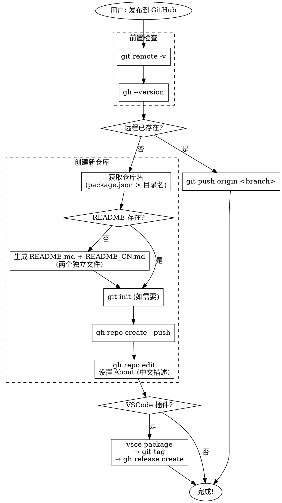

# GitHub 仓库发布

## 概述

将本地代码仓库一键发布到 GitHub，自动处理 README、About 信息、Release 发布等。

**核心原则：最小化交互，自动化处理。**

## 触发条件

```
用户说"发布到 GitHub" / "push 到远端" / "创建 GitHub 仓库"
    ↓
使用此 skill
```

## 前置检查

### 检查远程仓库是否已存在

```bash
git remote -v
```

- **如果 origin 已存在**：仓库已发布，直接推送更新 `git push origin <branch>`
- **如果 origin 不存在**：继续创建新仓库流程

### 检查 gh CLI 是否可用

```bash
gh --version
```

- 如果未安装：提示 `brew install gh` 然后 `gh auth login`
- 如果未登录：提示 `gh auth login`

## 工具选择

**必须使用 `gh` CLI**（GitHub CLI），不是 git 命令。

- `gh repo create` - 创建仓库
- `gh release create` - 创建 Release
- `gh repo edit` - 修改 About 信息

## 完整流程

### 1. 确定仓库名（仅此一次交互）

**优先级顺序：**
1. 用户显式指定的名称
2. `package.json` 的 `name` 字段（需清理 scope）
3. 当前目录名

```bash
# 清理 package.json name 的 scope 前缀
# @org/cool-tool → cool-tool
CLEANED_NAME=$(echo "$PACKAGE_NAME" | sed 's/^@[\w-]*\//')

# 转换规则：转小写，空格转连字符，移除非字母数字
```

**交互规则：**
- 用户说"按默认的来"/"别问我" → 直接使用默认值，无交互
- 正常情况 → 使用 AskUserQuestion 确认一次（可跳过）

**交互限制：最多一次交互确认仓库名。**

### 2. 检查并生成 README 文件

**重要：使用两个独立的 README 文件，而不是合并。**

```bash
# 检查 README 是否存在
if [ ! -f README.md ]; then
    # 生成 README.md（英文版）
    # 生成 README_CN.md（中文版）
fi
```

**文件结构：**

```
project/
├── README.md      # 英文版（主文件）
└── README_CN.md   # 中文版
```

**README.md（英文版）模板：**

```markdown
# Project Name

Brief description in English.

[中文文档](./README_CN.md)

## Features
...

## Installation
...

## Usage
...

## License

MIT
```

**README_CN.md（中文版）模板：**

```markdown
# 项目名称

中文简介。

[English](./README.md)

## 功能特性
...

## 安装
...

## 使用方法
...

## 许可证

MIT
```

**注意事项：**
- 两个文件互相链接
- README.md 是主文件（GitHub 默认显示）
- README_CN.md 是中文补充

### 3. 初始化 Git（如需要）

```bash
# 检查是否已初始化
if [ ! -d .git ]; then
    git init
    git add .
    git commit -m "Initial commit"
fi
```

### 4. 创建远程仓库并推送

```bash
# 尝试配置代理（可能失败）
git config --global http.proxy http://127.0.0.1:7890
git config --global https.proxy http://127.0.0.1:7890

# 创建仓库并推送
gh repo create $REPO_NAME --public --source=. --push --description "$DESCRIPTION"

# 如果代理失败，取消代理后重试
if [ $? -ne 0 ]; then
    git config --global --unset http.proxy
    git config --global --unset https.proxy
    git push -u origin main
fi

# 完成后取消代理
git config --global --unset http.proxy
git config --global --unset https.proxy
```

### 5. 设置 About 信息

**重要：Description 使用中文。**

```bash
# 设置中文描述
gh repo edit --description "中文描述，简要说明项目功能"

# 设置 topics（英文）
gh repo edit --add-topic "nodejs,typescript,cli-tool"
```

**Description 来源优先级：**
1. package.json 的 description（翻译成中文）
2. 从代码功能总结（用中文描述）

### 6. 特殊项目处理

#### 6.1 VSCode 插件（.vsix 发布到 Release）

```bash
# 检测是否为 VSCode 插件
if grep -q '"engines".*"vscode"' package.json; then
    # 打包插件
    npx vsce package

    # 获取版本号
    VERSION=$(node -p "require('./package.json').version")

    # 创建 tag
    git tag "v$VERSION"
    git push origin "v$VERSION"

    # 创建 Release 并上传 .vsix
    gh release create "v$VERSION" \
        --title "v$VERSION" \
        --notes "Release v$VERSION" \
        "*.vsix"
fi
```

#### 6.2 Node.js 库（提示 npm 发布）

```bash
# 检测是否为 Node.js 库（有 main/module/exports 但无 vscode）
if [ -f package.json ] && [ -z "$VSCODE_ENGINE" ]; then
    # 检查是否有 main, module, 或 exports
    if grep -qE '"main"|"module"|"exports"' package.json; then
        echo "检测到 Node.js 库，如需发布到 npm，请运行："
        echo "  npm publish --access public  # scoped packages"
        echo "  npm publish                  # regular packages"
    fi
fi
```

**注意：此 skill 专注于 GitHub 发布，npm 发布由用户自行决定。**

## 快速参考

| 步骤 | 命令 |
|------|------|
| 创建仓库 | `gh repo create $NAME --public --source=. --push` |
| 设置描述 | `gh repo edit --description "$中文描述"` |
| 创建 Release | `gh release create $TAG --title "$TITLE" "*.vsix"` |
| 打 tag | `git tag $TAG && git push origin $TAG` |

## 常见错误

| 错误 | 原因 | 解决 |
|------|------|------|
| `gh: command not found` | 未安装 GitHub CLI | `brew install gh` |
| `permission denied` | 未登录 gh | `gh auth login` |
| `repository already exists` | 远程仓库已存在 | 直接推送更新或使用 `gh repo edit` |
| `.vsix already exists` | 重复打包 | 删除旧的 .vsix 文件 |
| `origin already exists` | 本地已配置远程 | 检查 `git remote -v`，直接 push |
| `Failed to connect to proxy` | 代理未启动 | 取消代理后直接推送 |

## 禁止事项

- **不要多次交互**：最多一次确认仓库名
- **不要询问 README**：没有就自动生成
- **不要询问 About**：自动从代码总结，使用中文
- **不要合并中英文 README**：创建两个独立文件
- **不要忽略 Release**：VSCode 插件必须发布到 Release
- **不要提交 .vsix 到仓库**：只发布到 Release，添加到 .gitignore
- **不要在远程已存在时报错**：智能处理，直接推送更新

## 完整检查清单

- [ ] 检查远程仓库是否已存在（`git remote -v`）
- [ ] 确认仓库名（最多一次交互）
- [ ] 检查/生成 README.md（英文）和 README_CN.md（中文）
- [ ] 检查/补充 .gitignore
- [ ] 初始化 git（如需要）
- [ ] 配置代理（可选，失败时跳过）
- [ ] 创建远程仓库并推送
- [ ] 设置 About 描述（中文）和 topics（英文）
- [ ] 检测 VSCode 插件 → 打包 → 打 tag → 创建 Release
- [ ] 取消代理

## 流程图


