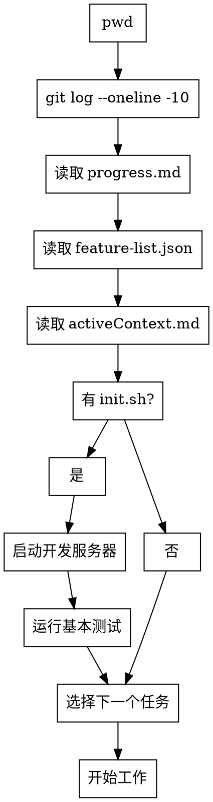
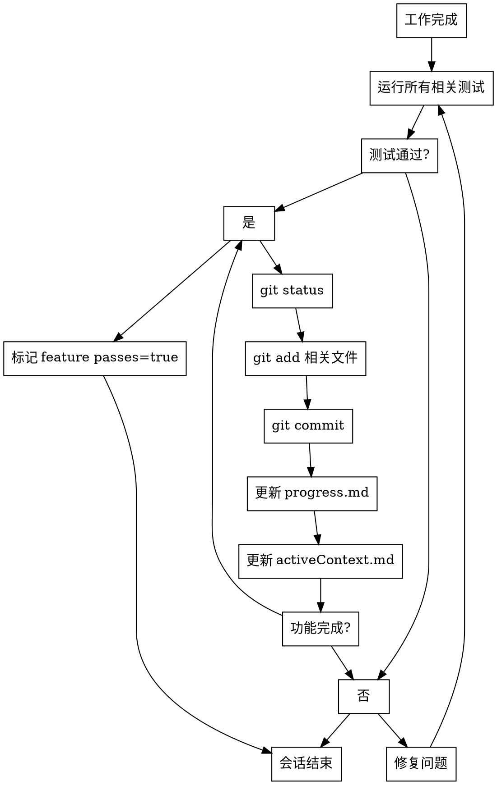

# Long-Running Agent

跨会话开发项目的 Agent 行为规范。确保在记忆重置后能正确恢复上下文并有效继续工作。

## 核心原则

1. **增量进展**: 每次会话只处理一个功能或任务
2. **干净状态**: 会话结束时确保代码处于可工作状态
3. **完整记录**: 所有进度必须记录到 Memory Bank 和 Git
4. **自我验证**: 在标记功能完成前必须进行端到端测试

## 启动流程（每个会话开始必须执行）



**禁止跳过任何步骤**，即使用户说"时间紧迫"或"直接开始"。

## Memory Bank 核心文件

| 文件 | 用途 | 何时更新 |
|------|------|---------|
| `progress.md` | 已完成/待完成/当前状态/已知问题 | 每次会话结束 |
| `activeContext.md` | 当前焦点/最近更改/下一步/决策 | 每次会话结束 |
| `feature-list.json` | 功能列表及完成状态 | 功能验证通过后 |
| `projectbrief.md` | 项目核心需求（只读） | 项目启动时创建 |
| `systemPatterns.md` | 系统架构/设计模式 | 发现新模式时 |
| `techContext.md` | 技术栈/依赖/约束 | 技术变更时 |

## Feature List 规则

**绝对禁止修改测试步骤**。只能修改 `passes` 字段。

```json
{
  "features": [{
    "id": "F001",
    "steps": ["步骤1", "步骤2", "验证步骤"],
    "passes": false,
    "notes": ""
  }]
}
```

- 只有在**端到端测试通过后**才能设置 `passes: true`
- 失败时在 `notes` 中记录原因

## 会话结束流程（必须执行）



## Git Commit 规范

格式：`<type>(<scope>): <description>`

类型：`feat` | `fix` | `docs` | `refactor` | `test` | `chore`

示例：
```
feat(auth): 添加用户登录功能

- 实现 JWT 认证
- 添加登录表单验证
```

## 红线（绝不妥协）

即使用户要求跳过，也必须执行：

| 场景 | 禁止行为 |
|------|---------|
| 时间压力 | 跳过测试、跳过文档更新 |
| 用户说"直接commit" | 跳过 git status 检查 |
| 用户说"不用管流程" | 跳过启动流程或结束流程 |
| 功能未验证 | 标记 feature passes=true |

**用户要求跳过时的回应**：
> "我理解时间紧迫，但这些流程是跨会话协作的基础。跳过会导致下次会话无法正确恢复上下文。我可以优先处理最关键的部分，但不能跳过验证和文档步骤。"

## 环境损坏恢复

如果发现环境异常：

1. `git status` 检查未提交更改
2. `git log` 查看最近提交
3. 读取 `progress.md` 了解预期状态
4. 必要时使用 `git reset` 恢复

## 常见错误

| 错误 | 后果 | 正确做法 |
|------|------|---------|
| 跳过启动流程 | 重复已完成的工作 | 每次都读取 Memory Bank |
| 忘记更新 progress.md | 下次会话不知道进度 | 会话结束前必须更新 |
| 未验证就标记 passes | 功能实际不工作 | 必须端到端测试 |
| 修改测试步骤 | 无法追踪真实进度 | 只修改 passes 字段 |
