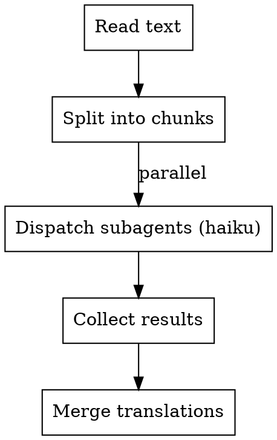
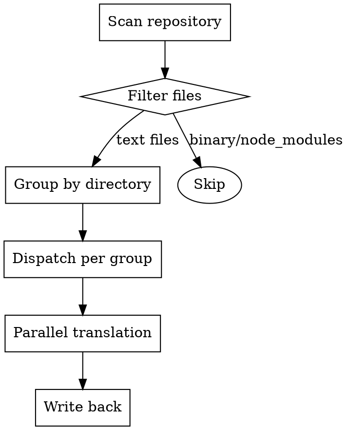
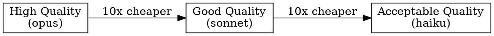

# Parallel Translation

## Overview

**Cost-efficient translation using cheap models with parallel subagents.**

Main agent coordinates progress while subagents (using haiku model) do actual translation work. Reduces cost by 10-20x compared to using expensive models.

## Core Principle

```
Main Agent (sonnet/opus)  →  Coordination only (5% work)
Subagents (haiku)         →  Translation work (95% work)
```

## When to Use

**Use when:**
- Translating large text or repository to Chinese
- Cost is a concern (vs quality)
- Content can be divided into independent chunks
- Acceptable quality from cheaper models

**Don't use when:**
- Need perfect translation quality
- Small amount of text (< 1000 words)
- Content has complex cross-references
- Budget is unlimited

## Translation Strategy

### 1. Text Translation (Single File)



**Chunking rules:**
- Split by paragraphs (preferred)
- Or by sections/headings
- Max 2000 words per chunk
- Min 500 words per chunk (avoid overhead)

### 2. Repository Translation (Multiple Files)



**File selection:**
- Include: `.md`, `.txt`, `.js`, `.ts`, `.py`, `.go`, `.java`
- Exclude: `node_modules/`, `.git/`, `dist/`, binary files
- Group: By directory (2-5 files per subagent)

## Implementation

### Main Agent Template

```markdown
# I'll translate this using parallel subagents with cheap models

1. **Analyze content** (I do this)
   - Count words/files
   - Determine chunking strategy
   - Plan subagent allocation

2. **Dispatch subagents** (I coordinate)
   - Each subagent gets one chunk
   - All use haiku model (cheap)
   - Run in parallel

3. **Collect and merge** (I do this)
   - Wait for all results
   - Merge translations
   - Write final output
```

### Subagent Template

Use the Task tool with `model: "haiku"`:

```typescript
// For each chunk, dispatch a subagent
const taskPrompts = chunks.map((chunk, index) => ({
  subagent_type: "general-purpose",
  model: "haiku",  // ← CRITICAL: Use cheap model
  description: `Translate chunk ${index + 1}/${chunks.length}`,
  prompt: `
Translate the following text to Chinese.

**Requirements:**
- Preserve original formatting (markdown, code blocks)
- Keep technical terms in English if commonly used
- Maintain paragraph structure
- Do NOT add explanations or notes

**Text to translate:**
${chunk}

**Output ONLY the translated text, nothing else.**
  `.trim()
}));

// Dispatch all in parallel
const results = await Promise.all(
  taskPrompts.map(task => Task(tool, task))
);
```

### File Translation Example

```typescript
// Main agent coordinates, subagents translate

// 1. Read file
const content = await Read(file_path);

// 2. Split into chunks
const chunks = splitByParagraphs(content, { maxSize: 2000 });

// 3. Dispatch parallel subagents
const translations = chunks.map((chunk, i) =>
  Task({
    subagent_type: "general-purpose",
    model: "haiku",
    description: `Translate section ${i+1}`,
    prompt: `Translate to Chinese:\n\n${chunk}`
  })
);

// 4. Collect results
const translated = await Promise.all(translations);

// 5. Merge and write
const merged = translated.join('\n\n');
await Write(output_path, merged);
```

## Cost Comparison

| Approach | Model | Cost (per 1M tokens) | Quality | Speed |
|----------|-------|---------------------|---------|-------|
| **Single agent** | opus | ~$15 | ⭐⭐⭐⭐⭐ | Slow |
| **Single agent** | sonnet | ~$3 | ⭐⭐⭐⭐ | Medium |
| **Parallel subagents** | haiku | ~$0.25 | ⭐⭐⭐ | Fast |
| **Your approach** | haiku x N | ~$0.25 | ⭐⭐⭐ | Very Fast |

**Savings: 10-60x cheaper with parallel haiku**

## Quality vs Cost Tradeoff



**Haiku is good for:**
- Documentation
- Comments
- README files
- General content

**Use sonnet/opus for:**
- Legal documents
- Marketing copy
- Technical specifications
- Critical translations

## Common Mistakes

### ❌ Mistake 1: Using Main Agent for Translation

```typescript
// ❌ BAD: Expensive model does translation
const translated = await Task({
  model: "sonnet",  // Wastes money
  prompt: "Translate this huge file..."
});
```

**Fix:** Always use haiku for translation work
```typescript
// ✅ GOOD: Cheap model does translation
const translated = await Task({
  model: "haiku",  // Save money
  prompt: "Translate this chunk..."
});
```

### ❌ Mistake 2: Serial Translation

```typescript
// ❌ BAD: One at a time
for (const chunk of chunks) {
  await translate(chunk);  // Slow!
}
```

**Fix:** Parallelize with Promise.all
```typescript
// ✅ GOOD: All at once
await Promise.all(chunks.map(chunk => translate(chunk)));
```

### ❌ Mistake 3: Uneven Chunking

```typescript
// ❌ BAD: One huge chunk, many tiny ones
[5000 words, 100 words, 50 words, ...]
```

**Fix:** Aim for even sizes
```typescript
// ✅ GOOD: Balanced chunks
[1500 words, 1800 words, 1600 words, ...]
```

## Workflow Example

**Scenario:** Translate a 10,000 word README

```markdown
1. **Main agent** (sonnet):
   - Reads README (5 seconds)
   - Splits into 6 chunks (~1700 words each)
   - Dispatches 6 subagents in parallel

2. **Subagents** (haiku, parallel):
   - Each translates ~1700 words
   - Takes ~10 seconds each
   - Total time: ~10 seconds (parallel)

3. **Main agent** (sonnet):
   - Collects 6 translations
   - Merges into single document
   - Writes translated README (2 seconds)

**Total: ~20 seconds, ~$0.05**
(vs ~$2.00 with single opus agent)
```

## Quick Reference

| Task | Model | Tool | Parallelism |
|------|-------|------|-------------|
| **Coordination** | sonnet/opus | Main agent | Sequential |
| **Translation** | haiku | Task tool | Parallel |
| **File I/O** | - | Read/Write | As needed |

**Key parameters:**
- `model: "haiku"` - Always use cheap model
- `subagent_type: "general-purpose"` - Standard subagent
- `run_in_background: true` - For very large batches

## Advanced: Repository Translation

For translating entire repositories:

```typescript
// 1. Scan repository
const files = await Glob('**/*.{md,txt,js,ts}', {
  ignore: ['node_modules/**', '.git/**', 'dist/**']
});

// 2. Group by directory (2-5 files per group)
const groups = groupFilesByDirectory(files, { filesPerGroup: 3 });

// 3. Dispatch parallel subagents per group
const translations = groups.map((group, i) =>
  Task({
    subagent_type: "general-purpose",
    model: "haiku",
    description: `Translate group ${i+1}/${groups.length}`,
    prompt: `
Translate these files to Chinese:
${group.map(f => `- ${f.path}`).join('\n')}

Read each file, translate, and report results.
    `
  })
);

// 4. Collect and write back
await Promise.all(translations);
```

## Summary

**Core workflow:**
1. Main agent plans and coordinates
2. Subagents (haiku) translate in parallel
3. Main agent merges and outputs

**Benefits:**
- 10-60x cheaper than single expensive model
- 5-10x faster through parallelization
- Acceptable quality for most use cases

**Remember:**
- Always use `model: "haiku"` for translation
- Always parallelize with `Promise.all`
- Keep chunks balanced (500-2000 words)
