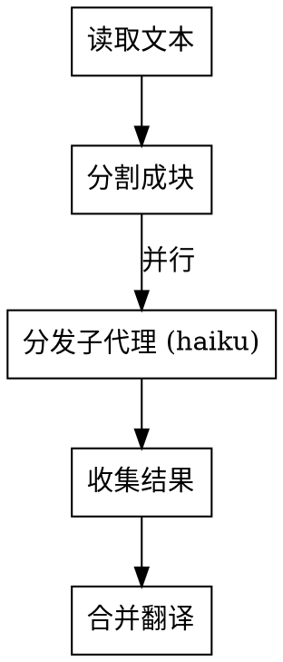
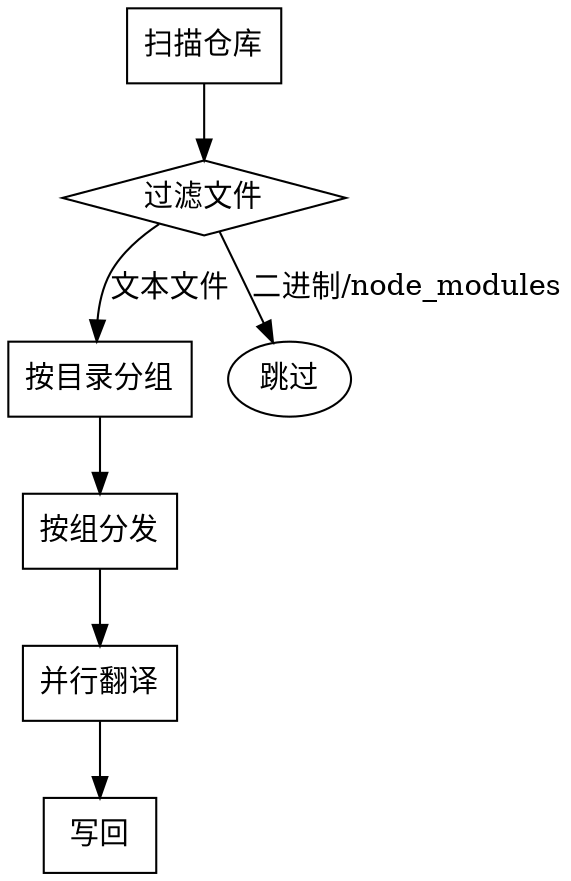
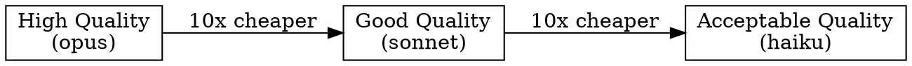

# 并行翻译

## 概述

**使用廉价模型和并行子代理进行成本高效的翻译。**

主代理协调进度，而子代理（使用 haiku 模型）执行实际翻译工作。与使用昂贵模型相比，成本降低 10-20 倍。

## 核心原则

```
主代理 (sonnet/opus)  →  仅协调工作（5% 的工作量）
子代理 (haiku)       →  翻译工作（95% 的工作量）
```

## 何时使用

**在以下情况使用：**
- 将大量文本或仓库翻译成中文
- 成本是考虑因素（相对于质量而言）
- 内容可以分成独立的块
- 可以接受来自廉价模型的合格质量

**在以下情况不要使用：**
- 需要完美的翻译质量
- 文本量少（< 1000 字）
- 内容有复杂的交叉引用
- 预算无限制

## 翻译策略

### 1. 文本翻译（单文件）



**分块规则：**
- 按段落分割（首选）
- 或按章节/标题分割
- 每块最多 2000 字
- 每块最少 500 字（避免开销）

### 2. 仓库翻译（多文件）



**文件选择：**
- 包含：`.md`, `.txt`, `.js`, `.ts`, `.py`, `.go`, `.java`
- 排除：`node_modules/`, `.git/`, `dist/`, 二进制文件
- 分组：按目录（每个子代理 2-5 个文件）

## 实现

### 主代理模板

```markdown
# 我将使用并行子代理和廉价模型进行翻译

1. **分析内容**（我做这个）
   - 计算字数/文件数
   - 确定分块策略
   - 规划子代理分配

2. **分发子代理**（我协调）
   - 每个子代理获得一个块
   - 都使用 haiku 模型（廉价）
   - 并行运行

3. **收集和合并**（我做这个）
   - 等待所有结果
   - 合并翻译
   - 写入最终输出
```

### Subagent 模板

使用 Task 工具并设置 `model: "haiku"`：

```typescript
// For each chunk, dispatch a subagent
const taskPrompts = chunks.map((chunk, index) => ({
  subagent_type: "general-purpose",
  model: "haiku",  // ← CRITICAL: Use cheap model
  description: `Translate chunk ${index + 1}/${chunks.length}`,
  prompt: `
Translate the following text to Chinese.

**Requirements:**
- Preserve original formatting (markdown, code blocks)
- Keep technical terms in English if commonly used
- Maintain paragraph structure
- Do NOT add explanations or notes

**Text to translate:**
${chunk}

**Output ONLY the translated text, nothing else.**
  `.trim()
}));

// Dispatch all in parallel
const results = await Promise.all(
  taskPrompts.map(task => Task(tool, task))
);
```

### 文件翻译示例

```typescript
// Main agent coordinates, subagents translate

// 1. Read file
const content = await Read(file_path);

// 2. Split into chunks
const chunks = splitByParagraphs(content, { maxSize: 2000 });

// 3. Dispatch parallel subagents
const translations = chunks.map((chunk, i) =>
  Task({
    subagent_type: "general-purpose",
    model: "haiku",
    description: `Translate section ${i+1}`,
    prompt: `Translate to Chinese:\n\n${chunk}`
  })
);

// 4. Collect results
const translated = await Promise.all(translations);

// 5. Merge and write
const merged = translated.join('\n\n');
await Write(output_path, merged);
```

## 成本对比

| 方法 | 模型 | 成本（每 100 万 tokens） | 质量 | 速度 |
|------|------|------------------------|------|------|
| **单个代理** | opus | ~$15 | ⭐⭐⭐⭐⭐ | 慢 |
| **单个代理** | sonnet | ~$3 | ⭐⭐⭐⭐ | 中等 |
| **并行子代理** | haiku | ~$0.25 | ⭐⭐⭐ | 快 |
| **你的方法** | haiku x N | ~$0.25 | ⭐⭐⭐ | 非常快 |

**节省：使用并行 haiku 便宜 10-60 倍**

## 质量与成本权衡



**Haiku 适用于：**
- 文档
- 注释
- README 文件
- 一般内容

**使用 sonnet/opus：**
- 法律文件
- 营销文案
- 技术规范
- 关键翻译

## 常见错误

### ❌ 错误 1：使用主代理进行翻译

```typescript
// ❌ 错误：昂贵的模型做翻译
const translated = await Task({
  model: "sonnet",  // 浪费金钱
  prompt: "Translate this huge file..."
});
```

**修复：** 始终使用 haiku 进行翻译工作
```typescript
// ✅ 正确：便宜的模型做翻译
const translated = await Task({
  model: "haiku",  // 节省金钱
  prompt: "Translate this chunk..."
});
```

### ❌ 错误 2：串行翻译

```typescript
// ❌ 错误：一个接一个
for (const chunk of chunks) {
  await translate(chunk);  // 太慢了！
}
```

**修复：** 使用 Promise.all 并行处理
```typescript
// ✅ 正确：同时处理所有
await Promise.all(chunks.map(chunk => translate(chunk)));
```

### ❌ 错误 3：分块不均匀

```typescript
// ❌ 错误：一个巨大的块，许多小块
[5000 words, 100 words, 50 words, ...]
```

**修复：** 保持块大小均匀
```typescript
// ✅ 正确：平衡的块
[1500 words, 1800 words, 1600 words, ...]
```

## 工作流示例

**场景：** 翻译一个 10,000 字的 README

```markdown
1. **主代理** (sonnet)：
   - 读取 README（5 秒）
   - 分成 6 个块（约 1700 字/块）
   - 并行调度 6 个子代理

2. **子代理** (haiku，并行)：
   - 每个翻译 ~1700 字
   - 每个耗时 ~10 秒
   - 总时间：~10 秒（并行）

3. **主代理** (sonnet)：
   - 收集 6 个翻译结果
   - 合并为单个文档
   - 写入翻译后的 README（2 秒）

**总计：~20 秒，~$0.05**
（vs 使用单个 opus 代理 ~$2.00）
```

## 快速参考

| 任务 | 模型 | 工具 | 并行性 |
|------|-------|------|-------------|
| **协调** | sonnet/opus | 主代理 | 顺序 |
| **翻译** | haiku | 任务工具 | 并行 |
| **文件I/O** | - | 读写 | 按需 |

**关键参数：**
- `model: "haiku"` - 总是使用廉价模型
- `subagent_type: "general-purpose"` - 标准子代理
- `run_in_background: true` - 用于大批量操作

## 高级：仓库翻译

用于翻译整个仓库：

```typescript
// 1. 扫描仓库
const files = await Glob('**/*.{md,txt,js,ts}', {
  ignore: ['node_modules/**', '.git/**', 'dist/**']
});

// 2. 按目录分组（每组2-5个文件）
const groups = groupFilesByDirectory(files, { filesPerGroup: 3 });

// 3. 每组分发并行子代理
const translations = groups.map((group, i) =>
  Task({
    subagent_type: "general-purpose",
    model: "haiku",
    description: `翻译第${i+1}/${groups.length}组`,
    prompt: `
将这些文件翻译成中文：
${group.map(f => `- ${f.path}`).join('\n')}

读取每个文件，翻译，并报告结果。
    `
  })
);

// 4. 收集并写回
await Promise.all(translations);
```

## 总结

**核心工作流程：**
1. 主代理规划和协调
2. 子代理（haiku）并行翻译
3. 主代理合并和输出

**优势：**
- 比单一昂贵模型便宜10-60倍
- 通过并行化快5-10倍
- 对大多数用例质量可接受

**记住：**
- 翻译时总是使用 `model: "haiku"`
- 总是使用 `Promise.all` 进行并行化
- 保持块平衡（500-2000字）
